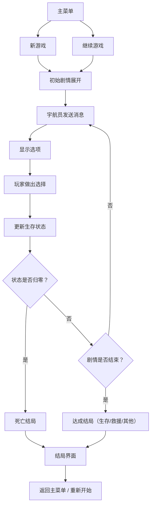

## 1. 产品概述
一款致敬《生命线》的沉浸式文字冒险游戏，玩家通过实时消息与一名落单的宇航员沟通，帮助他分析局势、做出关键抉择，决定他的生死存亡。

- 核心玩法：聊天式互动叙事 + 分支剧情 + 实时生存状态管理
- 目标用户：喜欢叙事类游戏、互动小说、生存冒险题材的玩家
- 产品价值：提供紧张刺激的沉浸式体验，每一个选择都影响剧情走向和宇航员的命运

## 2. 核心功能

### 2.1 用户角色
| 角色 | 注册方式 | 核心权限 |
|------|----------|----------|
| 玩家 | 无需注册，本地存档 | 进行游戏、读取存档、调整设置 |

### 2.2 功能模块
1. **主菜单页面**：游戏开始、继续游戏、新游戏、关于说明
2. **游戏主界面**：聊天消息区、宇航员状态面板、选项区
3. **结局界面**：结局展示、数据统计、重新开始

### 2.3 页面详情
| 页面名称 | 模块名称 | 功能描述 |
|----------|----------|----------|
| 主菜单 | 标题展示 | 游戏标题动画、背景氛围效果 |
| 主菜单 | 菜单按钮 | 新游戏、继续游戏、游戏说明 |
| 游戏界面 | 聊天消息区 | 宇航员发送消息（打字动画）、玩家回复选项、时间戳 |
| 游戏界面 | 状态面板 | 生命值、氧气、体力、信号强度四项状态实时显示 |
| 游戏界面 | 选项区 | 2-4个选择按钮，玩家做出抉择 |
| 游戏界面 | 顶部导航 | 游戏设置、返回菜单、存档 |
| 结局界面 | 结局展示 | 结局标题、描述文字、存活状态 |
| 结局界面 | 统计数据 | 游戏时长、做出的选择数、关键事件回顾 |
| 结局界面 | 操作按钮 | 重新开始、返回主菜单 |

## 3. 核心流程

玩家进入游戏 → 开始新游戏/继续游戏 → 接收宇航员的求救消息 → 阅读当前局势 → 从选项中选择回复 → 根据选择更新状态和剧情分支 → 继续下一轮对话 → 最终达成某种结局（生存/死亡/救援等）

## 4. 用户界面设计

### 4.1 设计风格
- **主色调**：深空黑（#0a0e17）+ 幽蓝（#1e3a5f）+ 警示红（#e63946）+ 生命绿（#2ecc71）
- **辅助色**：信号橙（#ff9f1c）、氧气蓝（#48cae4）
- **整体风格**：科幻、紧迫、沉浸式，模拟卫星通讯终端界面
- **字体**：标题使用等宽字体（JetBrains Mono），正文使用易读无衬线字体
- **按钮样式**：圆角矩形，霓虹光效边框，悬浮时发光
- **动效**：打字机效果、消息渐入、信号干扰闪烁、状态条变化动画
- **图标**：线性图标，配合状态颜色变化

### 4.2 页面设计概览
| 页面名称 | 模块名称 | UI 元素 |
|----------|----------|----------|
| 主菜单 | 标题区 | 大号等宽字体标题、闪烁的光标效果、深空背景星空粒子动画 |
| 主菜单 | 按钮区 | 垂直排列三个主按钮，带霓虹边框和悬浮发光 |
| 游戏界面 | 状态面板 | 四个状态条：生命（红）、氧气（蓝）、体力（绿）、信号（橙），带数值和百分比 |
| 游戏界面 | 消息区 | 左侧宇航员消息气泡（蓝色系），右侧玩家消息气泡（绿色系），时间戳，打字中指示器 |
| 游戏界面 | 选项区 | 底部选项按钮组，2-4个按钮，点击后锁定 |
| 结局界面 | 结局展示 | 大号结局标题、状态图标（存活/死亡）、结局叙事文字 |
| 结局界面 | 数据统计 | 游戏时长、选择数量、关键事件列表 |

### 4.3 响应式
- 桌面端：聊天区居中，状态面板固定在顶部或侧边
- 移动端：状态面板固定顶部，聊天区占满屏幕，选项按钮底部排列
- 触控优化：按钮最小高度 44px，间距充足
