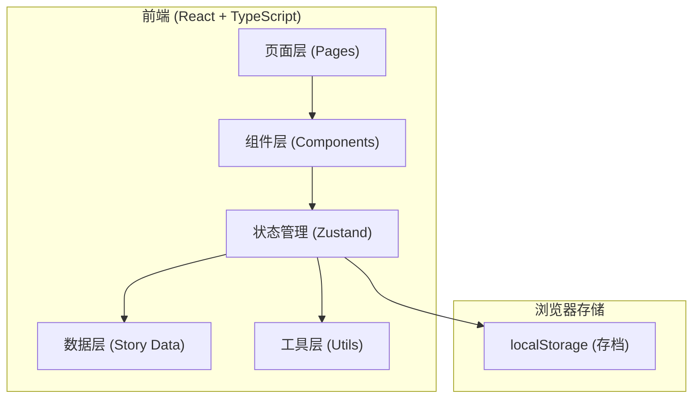

## 1. 架构设计



## 2. 技术描述
- **前端**：React 18 + TypeScript + Vite + Tailwind CSS 3 + Zustand
- **初始化工具**：vite-init（react-ts 模板）
- **后端**：无（纯前端，剧情数据内置）
- **存储**：localStorage 保存游戏进度

## 3. 路由定义
| 路由 | 用途 |
|------|------|
| / | 主菜单 |
| /game | 游戏主界面 |
| /ending | 结局展示界面 |

## 4. 数据模型

### 4.1 游戏状态
```typescript
interface GameState {
  isStarted: boolean;
  currentNodeId: string;
  messages: Message[];
  astronautStatus: AstronautStatus;
  choices: string[];
  startTime: number;
  lastSaveTime: number;
}
```

### 4.2 宇航员状态
```typescript
interface AstronautStatus {
  health: number;      // 生命值 0-100
  oxygen: number;      // 氧气 0-100
  stamina: number;     // 体力 0-100
  signal: number;      // 信号强度 0-100
}
```

### 4.3 消息
```typescript
interface Message {
  id: string;
  sender: 'astronaut' | 'player';
  content: string;
  timestamp: number;
  typingDelay?: number;
}
```

### 4.4 剧情节点
```typescript
interface StoryNode {
  id: string;
  messages: StoryMessage[];
  choices?: StoryChoice[];
  statusEffect?: Partial<AstronautStatus>;
  nextNodeId?: string;
  isEnding?: boolean;
  endingType?: 'survive' | 'death' | 'rescue' | 'sacrifice';
  endingTitle?: string;
  endingDescription?: string;
}

interface StoryMessage {
  sender: 'astronaut' | 'system';
  content: string;
  delay: number;
}

interface StoryChoice {
  id: string;
  text: string;
  nextNodeId: string;
  statusEffect?: Partial<AstronautStatus>;
  requireStatus?: Partial<AstronautStatus>;
}
```

## 5. 核心模块结构
```
src/
├── components/
│   ├── chat/
│   │   ├── MessageBubble.tsx    # 消息气泡
│   │   ├── TypingIndicator.tsx  # 打字指示器
│   │   └── ChatArea.tsx         # 聊天区域
│   ├── status/
│   │   ├── StatusBar.tsx        # 单个状态条
│   │   └── StatusPanel.tsx      # 状态面板
│   ├── choices/
│   │   └── ChoiceButtons.tsx    # 选项按钮组
│   └── common/
│       ├── Button.tsx           # 通用按钮
│       └── ParticleBackground.tsx  # 星空粒子背景
├── pages/
│   ├── MainMenu.tsx             # 主菜单
│   ├── GameScreen.tsx           # 游戏界面
│   └── EndingScreen.tsx         # 结局界面
├── store/
│   └── useGameStore.ts          # Zustand 状态管理
├── data/
│   └── story.ts                 # 剧情数据
├── types/
│   └── game.ts                  # 类型定义
├── utils/
│   ├── storage.ts               # localStorage 工具
│   └── format.ts                # 格式化工具
├── App.tsx
├── main.tsx
└── index.css
```
