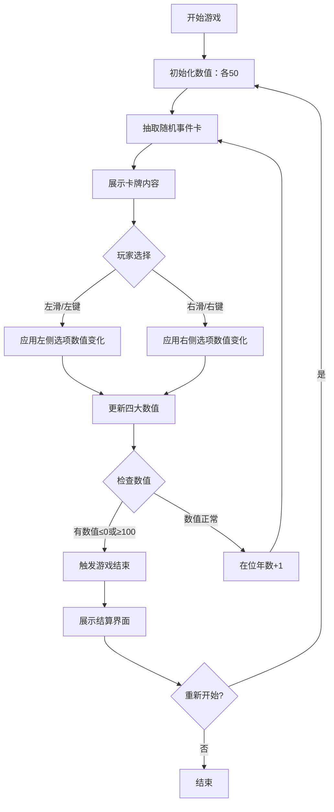

## 1. 产品概述

一款类似《王权》的宫廷决策卡牌游戏，玩家扮演中世纪国王，通过左右滑动卡牌做出抉择，平衡教会、人民、军队和财富四大势力。任何一方数值归零或爆表，统治即宣告结束。

- **目标用户**：休闲游戏玩家、策略游戏爱好者
- **核心价值**：简单上手的滑动操作 + 权衡抉择的策略深度 + 随机事件的重玩价值

## 2. 核心特性

### 2.1 功能模块

1. **主游戏界面**：四大数值条展示、当前卡牌、左右滑动区域、在位年数
2. **卡牌系统**：事件描述、人物形象、左右选项悬停预览
3. **数值系统**：教会(紫色)、人民(绿色)、军队(红色)、财富(金色)
4. **结束界面**：死亡原因、在位年数、重新开始

### 2.2 页面详情

| 页面名称 | 模块名称 | 功能描述 |
|-----------|-------------|---------------------|
| 游戏主页 | 顶部数值条 | 四大势力实时数值，低于阈值闪烁警示 |
| 游戏主页 | 中央卡牌区 | 可左右拖拽/点击的事件卡，带预览提示 |
| 游戏主页 | 底部信息栏 | 在位年数、当前国王名号、操作提示 |
| 结束弹窗 | 结算面板 | 展示死亡原因、存活年数、重新开始按钮 |

## 3. 核心流程

## 4. 用户界面设计

### 4.1 设计风格

- **主色调**：深酒红 #6B1D23 + 暗金 #B8860B + 羊皮纸米黄 #F5E6C8
- **背景**：深棕色渐变 + 暗纹肌理，营造宫廷厚重感
- **卡牌**：圆角矩形，金边装饰，羊皮纸纹理底，带投影立体感
- **数值条**：4条横向进度条，各势力独立配色，带图标和数值
- **字体**：衬线体展示标题，无衬线体正文，体现古典与现代平衡
- **动画**：卡牌滑动阻尼感、数值变化微弹动、结束画面渐显

### 4.2 页面设计概览

| 页面名称 | 模块名称 | UI 元素 |
|-----------|-------------|-------------|
| 游戏主页 | 顶部数值条 | 4个势力图标 + 彩色进度条 + 实时数字 |
| 游戏主页 | 中央卡牌 | 角色头像/图标 + 事件标题 + 事件描述 + 左右选项悬停提示 |
| 游戏主页 | 操作区 | 左侧拒绝按钮(红)、右侧同意按钮(绿)，或支持鼠标拖拽 |
| 结束弹窗 | 结算面板 | 大标题"统治结束"、死因描述、在位年限、金色重启按钮 |

### 4.3 响应式

- 桌面端优先，居中固定宽度卡片布局
- 移动端适配：卡牌缩放、触控滑动优化、按钮放大
- 支持触摸屏原生 swipe 手势

## 5. 游戏数值设计

### 5.1 四大势力

| 势力 | 颜色 | 图标 | 说明 |
|------|------|------|------|
| 教会 | 紫色 #8B5CF6 | ⛪ 教堂 | 宗教势力影响力 |
| 人民 | 绿色 #10B981 | 👥 民众 | 民众支持度 |
| 军队 | 红色 #EF4444 | ⚔️ 军队 | 军事力量忠诚度 |
| 财富 | 金色 #F59E0B | 💰 金库 | 国库充盈度 |

### 5.2 数值规则

- 初始值：每项 50，范围 0–100
- 单次变化：通常 ±5 到 ±20，部分极端事件 ±30
- 死亡条件：任何一项 ≤ 0 或 ≥ 100
- 事件卡库：30+ 张预设事件，随机抽取，可重复
