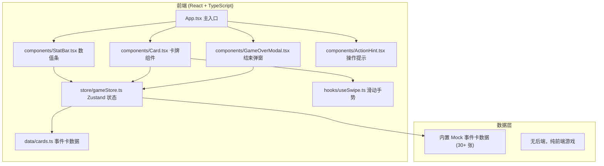

## 1. 架构设计



## 2. 技术说明

- **前端框架**：React 18 + TypeScript
- **构建工具**：Vite
- **样式方案**：Tailwind CSS 3
- **状态管理**：Zustand
- **图标库**：lucide-react
- **后端**：无（纯前端单页应用）
- **数据存储**：无需持久化，刷新即重开

## 3. 路由定义

| 路由 | 用途 |
|-------|---------|
| / | 游戏主界面（单页应用，无多路由） |

## 4. 数据模型

### 4.1 游戏状态 (GameState)

```typescript
interface Stats {
  church: number;   // 教会 0-100
  people: number;   // 人民 0-100
  army: number;     // 军队 0-100
  wealth: number;   // 财富 0-100
}

interface GameState {
  stats: Stats;
  year: number;               // 在位年数
  currentCardIndex: number;   // 当前卡牌索引
  shuffledDeck: Card[];       // 洗牌后的卡堆
  isGameOver: boolean;
  deathReason: string;        // 死因描述
  deathStat: keyof Stats | null;
}
```

### 4.2 卡牌数据 (Card)

```typescript
interface StatChange {
  church?: number;
  people?: number;
  army?: number;
  wealth?: number;
}

interface Card {
  id: string;
  title: string;          // 事件标题，如"大主教求见"
  character: string;      // 人物/来源，如"红衣主教"
  emoji: string;          // 卡牌图标 emoji
  description: string;    // 事件描述
  leftChoice: {
    label: string;        // 左选项文字，如"拒绝"
    effect: StatChange;   // 数值影响
  };
  rightChoice: {
    label: string;        // 右选项文字，如"同意"
    effect: StatChange;   // 数值影响
  };
}
```

## 5. 核心函数

```typescript
// store/gameStore.ts
interface GameActions {
  startNewGame: () => void;
  makeChoice: (side: 'left' | 'right') => void;
  applyStatChange: (effect: StatChange) => void;
  checkGameOver: () => void;
  drawNextCard: () => void;
}
```

## 6. 项目结构

```
src/
├── components/
│   ├── StatBar.tsx        # 单条数值进度条
│   ├── StatPanel.tsx      # 四条数值容器
│   ├── GameCard.tsx       # 可滑动卡牌
│   ├── GameOverModal.tsx  # 结束弹窗
│   └── HintBar.tsx        # 底部操作提示 + 年数
├── data/
│   └── cards.ts           # 30+ 张事件卡 mock 数据
├── hooks/
│   └── useSwipe.ts        # 鼠标/触控滑动检测
├── store/
│   └── gameStore.ts       # Zustand 游戏状态
├── types/
│   └── index.ts           # 类型定义
├── App.tsx
├── main.tsx
└── index.css
```
