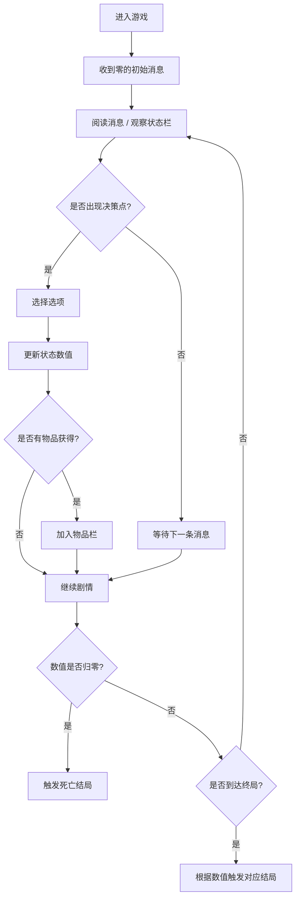

## 1. 产品概述

赛博朋克风格互动叙事游戏——《霓虹夜信》。玩家通过即时通讯界面陪伴一位身处险境的少女"零"，在霓虹都市的阴影中帮助她判断风险、寻找线索、做出关键决策。唯一的规则：别让她死。

- 核心目标：通过陪伴式叙事体验，让玩家产生强烈的情感联结与沉浸式紧张感
- 目标用户：喜欢互动叙事、悬疑解谜、赛博朋克美学的玩家群体

## 2. 核心功能

### 2.1 用户角色
| 角色 | 说明 | 核心权限 |
|------|------|----------|
| 玩家 | 第一视角，通过聊天界面与少女互动 | 发送消息、选择选项、使用物品、查看状态 |

### 2.2 功能模块
1. **主游戏界面**：聊天区、状态栏、快捷物品栏三位一体布局
2. **消息系统**：支持文字、语音（可视化波形）、图片线索、系统提示等多种消息类型
3. **状态系统**：生命值、饥饿度、信任度三大核心数值实时监控
4. **物品系统**：快捷物品栏存储关键道具，可在对话中使用
5. **剧情引擎**：分支叙事、条件判断、多结局支持
6. **决策系统**：关键时刻提供多个选项，影响数值与剧情走向

### 2.3 页面详情
| 页面名称 | 模块名称 | 功能描述 |
|----------|----------|----------|
| 游戏主页 | 聊天区 | 实时消息流，支持文字/语音/图片/系统消息混合展示，打字机动画，消息气泡 |
| 游戏主页 | 状态栏 | 生命值（血红色进度条）、饥饿度（橙黄色）、信任度（霓虹蓝），数值变化动画 |
| 游戏主页 | 快捷物品栏 | 底部横排格子，展示物品图标与名称，点击可在对话中使用 |
| 游戏主页 | 决策选择器 | 关键时刻弹出 2-4 个选项卡片，悬停发光效果 |
| 游戏主页 | 角色头像区 | 左上角显示"零"的手绘头像，带呼吸灯效，状态变化时表情切换 |

## 3. 核心流程

玩家进入游戏后，收到来自陌生少女"零"的紧急求助消息。随着对话推进，玩家需要：
1. 阅读她发送的文字/语音消息，理解当前处境
2. 观察状态栏数值，判断风险等级
3. 在决策点选择回复内容或行动方案
4. 收集线索物品存入物品栏，在适当时机使用
5. 根据三项数值的综合状态走向不同结局

## 4. 用户界面设计

### 4.1 设计风格
- **主色调**：深邃午夜蓝 (#0a0e1a) 基底，霓虹洋红 (#ff2d95)、电光青 (#00f0ff)、警示红 (#ff3b3b)、饥饿橙 (#ff9f1c) 作为强调色
- **辅助色**：暗紫色 (#1a1033) 渐变背景，手绘质感噪点纹理叠加
- **字体**：标题使用等宽赛博字体 (Share Tech Mono)，正文使用圆润手写风 (ZCOOL KuaiLe)，英文使用 VT323 像素字体
- **按钮风格**：霓虹描边 + 发光悬停，矩形切角设计，按下时内发光
- **布局风格**：三栏不对称布局——左侧聊天区（60%），右侧状态面板（40%），底部物品栏横跨
- **视觉特效**：CRT 扫描线、屏幕漏光、文字 Glitch 效果、消息气泡打字机动画、语音波形动画

### 4.2 页面设计概览
| 页面名称 | 模块名称 | UI 元素 |
|----------|----------|----------|
| 游戏主页 | 聊天区 | 深色气泡（对方）/ 霓虹渐变气泡（玩家），时间戳，语音消息带播放按钮和波形图，图片消息缩略图可放大，系统消息居中显示带警示边框 |
| 游戏主页 | 状态栏 | 三道霓虹进度条带数值文字，生命条带心跳脉冲动画，饥饿度闪烁警示，信任度粒子效果 |
| 游戏主页 | 快捷物品栏 | 半透明玻璃拟态格子，物品图标手绘风格，选中时发光高亮，物品悬浮提示 |
| 游戏主页 | 决策选择器 | 浮动卡片，切角矩形，悬停时霓虹边框流动，选中后渐隐消失 |
| 游戏主页 | 背景氛围 | 多层渐变 + 赛博朋克城市剪影 + 霓虹噪点纹理 + CRT 扫描线叠加 |

### 4.3 响应式
桌面端优先设计，三栏布局；移动端自适应为垂直堆叠（状态栏在上→聊天区居中→物品栏在底部）。

### 4.4 动效设计
- 消息入场：从下方滑入 + 渐显，延迟 100-300ms 错峰
- 打字效果：文字逐字显示，光标闪烁
- 数值变化：进度条平滑过渡 + 数字跳动动画
- 语音消息：波形条高低起伏循环动画
- 状态预警：低数值时边框呼吸闪烁红色
- 背景：霓虹光晕缓慢呼吸律动
