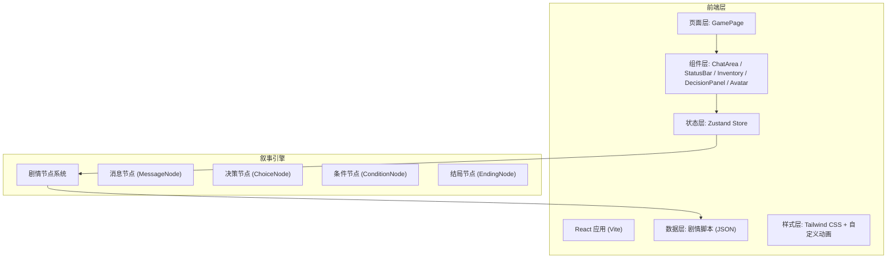

## 1. 架构设计



## 2. 技术描述
- **前端框架**: React 18 + TypeScript
- **构建工具**: Vite 6
- **样式方案**: Tailwind CSS 3 + 自定义 CSS 动画/关键帧
- **状态管理**: Zustand
- **图标库**: Lucide React
- **后端**: 无（纯前端单页应用，剧情数据本地 JSON）
- **数据存储**: LocalStorage（存档功能）

## 3. 路由定义
| 路由 | 用途 |
|------|------|
| / | 游戏主界面（唯一页面） |

## 4. 数据模型

### 4.1 游戏状态模型
```typescript
interface GameState {
  health: number;      // 0-100 生命值
  hunger: number;      // 0-100 饥饿度
  trust: number;       // 0-100 信任度
  inventory: Item[];   // 物品栏
  currentNodeId: string; // 当前剧情节点
  messageHistory: ChatMessage[]; // 消息历史
  isGameOver: boolean;
  endingType?: string;
  flags: Record<string, boolean>; // 剧情标记
}
```

### 4.2 剧情节点模型
```typescript
interface MessageNode {
  id: string;
  type: 'message';
  messages: ChatMessage[];
  nextNodeId?: string;
  effects?: Partial<GameState>; // 数值影响
  giveItem?: Item;
}

interface ChoiceNode {
  id: string;
  type: 'choice';
  prompt: string;
  choices: {
    id: string;
    text: string;
    nextNodeId: string;
    effects?: Partial<GameState>;
    requiredItem?: string;
  }[];
}

interface EndingNode {
  id: string;
  type: 'ending';
  endingType: 'good' | 'bad' | 'neutral' | 'death';
  title: string;
  description: string;
}
```

### 4.3 消息模型
```typescript
interface ChatMessage {
  id: string;
  sender: 'zero' | 'player' | 'system';
  type: 'text' | 'voice' | 'image' | 'clue';
  content: string;
  timestamp: number;
  voiceDuration?: number; // 秒
  imageUrl?: string;
}
```

### 4.4 物品模型
```typescript
interface Item {
  id: string;
  name: string;
  description: string;
  icon: string; // emoji 或图标标识
  usableIn?: string[]; // 可使用的节点 ID
}
```

## 5. 目录结构
```
src/
├── components/
│   ├── ChatArea.tsx       # 聊天区
│   ├── StatusBar.tsx      # 状态栏
│   ├── Inventory.tsx      # 快捷物品栏
│   ├── DecisionPanel.tsx  # 决策选择器
│   ├── Avatar.tsx         # 角色头像
│   ├── MessageBubble.tsx  # 消息气泡
│   └── EndingScreen.tsx   # 结局画面
├── hooks/
│   └── useGameEngine.ts   # 叙事引擎 Hook
├── store/
│   └── useGameStore.ts    # Zustand 状态管理
├── data/
│   └── story.ts           # 剧情脚本数据
├── types/
│   └── index.ts           # TypeScript 类型定义
├── utils/
│   └── animations.ts      # 动画工具函数
├── App.tsx
├── main.tsx
└── index.css
```
