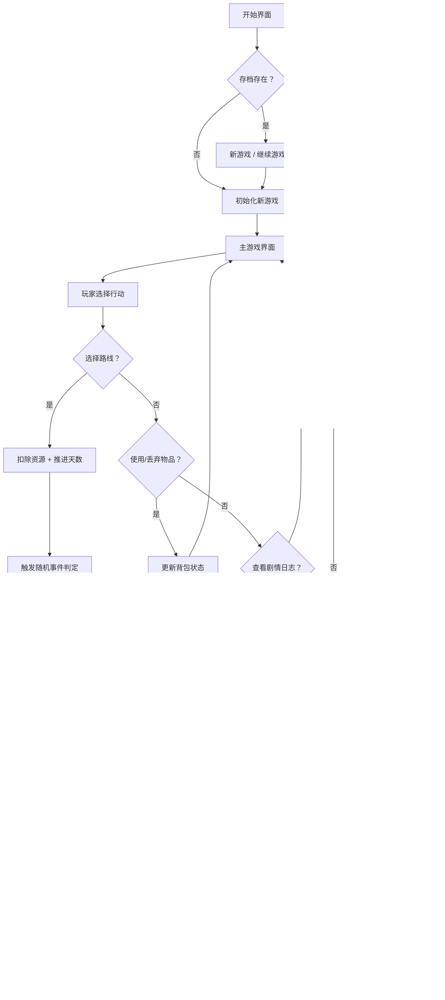

# PRD - 星际80天（Around the Galaxy in 80 Days）

## 1. 产品概述
一款科幻题材的文字剧情向轻策略网页游戏，致敬《80天环游地球》经典IP。玩家扮演星际探险家福格·星际爵士，需在80个星际日的倒计时内穿越银河完成环球航行。核心玩法融合「星际路线规划」与「资源（行李）管理」双重策略，配合沉浸式剧情叙事与随机事件系统，带来零门槛却富于深度的太空冒险体验。

- **目标用户**：喜爱文字剧情、策略规划、科幻题材的休闲与核心玩家
- **核心价值**：用极简界面承载丰富策略深度，让玩家在碎片化时间中体验完整的太空史诗

---

## 2. 核心功能

### 2.1 功能模块

1. **开始界面**：游戏标题、背景叙事、开始新游戏、继续游戏（存档）
2. **主游戏界面**：星际地图视图、倒计时面板、资源栏、剧情/事件日志
3. **路线规划模块**：显示当前位置、可到达星球、各路线的时间/燃料/风险成本
4. **行李管理模块**：装备物品、消耗品、特殊道具的背包系统，容量限制与取舍策略
5. **剧情叙事模块**：主线剧情对话、星球特色文本、角色互动描写
6. **随机事件系统**：旅途中的遭遇事件（太空海盗、星云风暴、友好文明等），提供多选项分支
7. **结算界面**：成功/失败结局展示、统计数据、重玩按钮

### 2.2 页面详情

| 页面名称 | 模块名称 | 功能描述 |
|---------|---------|---------|
| 开始界面 | 标题区 | 大标题"星际80天"、副标题、动态星空背景、科幻氛围动画 |
| 开始界面 | 操作区 | "开始新冒险"按钮、"继续旅程"按钮（存档存在时显示）、游戏说明弹窗 |
| 主界面 | 顶部状态栏 | 剩余天数（进度条+数字）、当前星币、燃料值、健康/士气值 |
| 主界面 | 中央星图 | 可视化星际航线图、当前位置高亮、可到达节点闪烁 |
| 主界面 | 左侧路线面板 | 可选目的地列表、每条路线的成本（时间/燃料/星币）、风险等级标签 |
| 主界面 | 右侧行李面板 | 8格背包网格、物品图标+名称+描述、丢弃/使用操作 |
| 主界面 | 底部剧情日志 | 滚动式叙事文本、最新剧情高亮、事件选项按钮组 |
| 事件弹窗 | 模态层 | 事件标题、剧情文本、2-4个选项（各有不同结果）、视觉特效 |
| 结算界面 | 结局展示 | 成功/失败标题、详细统计（用时/星币/事件数）、叙事结语 |

---

## 3. 核心流程

---

## 4. 用户界面设计

### 4.1 设计风格
- **美学方向**：新艺术风格 × 蒸汽朋克科幻（Art Nouveau Sci-Fi）——华丽装饰线条与未来感科技的融合
- **主色调**：深空靛蓝 `#0A0E27` 为底，星尘金 `#D4AF37` 为强调色，等离子青 `#00D4FF` 为辅助色，警报红 `#FF4D6D` 为警示
- **字体**：标题使用 Cinzel（古典衬线），正文使用 Cormorant Garamond（优雅衬线），数字/数据使用 JetBrains Mono（等宽科技感）
- **视觉元素**：装饰性几何边框、星图连线动画、粒子星空背景、发光节点光晕、纸张质感纹理
- **按钮样式**：圆角矩形 + 金色描边 + 悬停发光效果，禁用态灰化处理
- **动效**：页面切换用渐隐+滑动，按钮有按压反馈，事件出现时用缩放+淡入

### 4.2 页面设计概览

| 页面名称 | 模块名称 | UI 元素 |
|---------|---------|---------|
| 开始界面 | 标题区 | 超大衬线标题居中，金色渐变文字，副标题等离子青色，背景粒子星空缓慢流动 |
| 开始界面 | 操作区 | 两个大型主按钮垂直排列，金色边框发光悬停效果，"游戏说明"小按钮 |
| 主界面 | 顶部状态栏 | 深靛蓝底色，金色分隔线，4个数据卡片并排，每个卡片有图标+数值+进度环 |
| 主界面 | 中央星图 | SVG 绘制的银河航线图，星球节点为发光圆点，当前位置脉冲动画，可选目的地闪烁提示 |
| 主界面 | 路线面板 | 卡片式列表，每张卡片有星球名、距离（天数）、燃料消耗、星币费用、风险条（绿/黄/红），选中时金色高亮 |
| 主界面 | 行李面板 | 4×2 网格，每个格子有物品图标+名称+数量角标，悬停显示详细描述，右键菜单"使用/丢弃" |
| 主界面 | 剧情日志 | 仿羊皮纸质感背景，滚动条自定义为金色，最新段落用等离子青边框高亮 |
| 事件弹窗 | 模态层 | 半透明黑色遮罩，中央装饰边框卡片，标题金色加大，选项按钮垂直排列各有不同颜色暗示 |
| 结算界面 | 结局展示 | 全屏渐变背景（成功用金蓝渐变，失败用暗红渐变），大标题+统计卡片网格+结束语 |

### 4.3 响应式方案
- 桌面优先设计，最小支持 1280×720
- 平板端（≥768px）：左右面板改为上下堆叠，中央星图自适应缩放
- 移动端（<768px）：单列布局，星图简化为列表视图，行李面板改为可折叠抽屉

---
