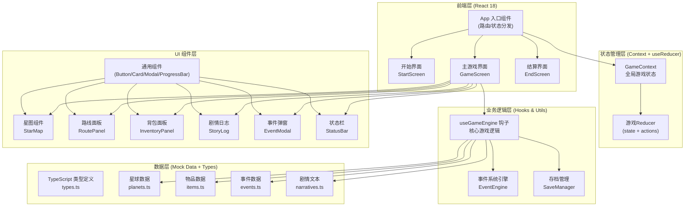
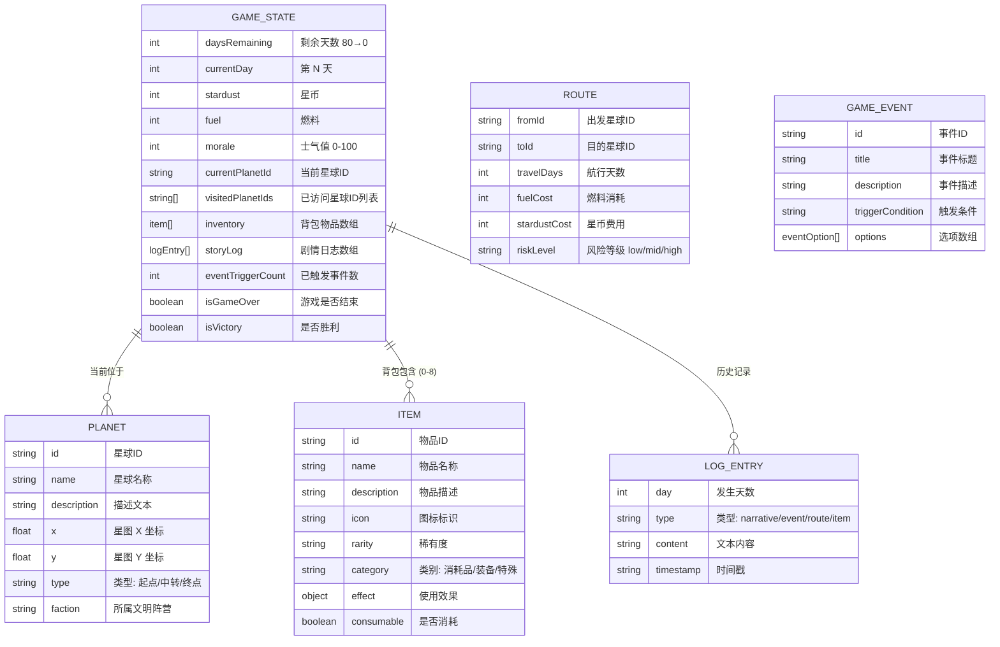

# 技术架构文档 - 星际80天

## 1. 架构设计



---

## 2. 技术说明

- **前端框架**：React@18 + TypeScript
- **构建工具**：Vite@5（快速冷启动 + HMR）
- **样式方案**：TailwindCSS@3 + CSS 变量（主题色统一管理）
- **状态管理**：React Context + useReducer（避免过度工程化，轻量可控）
- **本地存储**：localStorage（存档/读档功能）
- **图标方案**：Lucide React（现代风格 SVG 图标库）
- **后端**：无（纯前端游戏，所有数据本地 Mock）
- **数据库**：无（所有数据使用 TypeScript 常量定义）

### 项目结构
```
project9/
├── .trae/
│   └── documents/          # 文档目录
├── src/
│   ├── assets/             # 静态资源（字体、图片等）
│   ├── components/
│   │   ├── common/         # 通用 UI 组件
│   │   ├── game/           # 游戏专属组件
│   │   └── screens/        # 页面级组件
│   ├── context/            # Context + Reducer
│   ├── data/               # Mock 数据
│   ├── hooks/              # 自定义 Hooks
│   ├── types/              # TypeScript 类型定义
│   ├── utils/              # 工具函数
│   ├── App.tsx
│   ├── main.tsx
│   └── index.css
├── index.html
├── package.json
├── tsconfig.json
├── vite.config.ts
└── tailwind.config.js
```

---

## 3. 路由定义

| 逻辑路由 (组件级) | 目的 | 说明 |
|-----------------|------|------|
| StartScreen | 开始界面 | 游戏启动默认页，新游戏/继续游戏入口 |
| GameScreen | 主游戏界面 | 核心玩法承载页，所有游戏操作在此完成 |
| EndScreen | 结算界面 | 胜利/失败结局展示与统计 |

> 注：不引入 react-router，使用 useState 在 App.tsx 内切换屏幕，降低复杂度。

---

## 4. 数据模型

### 4.1 实体关系图



---

## 5. 核心状态与 Action 定义

```typescript
// 初始状态
interface GameState {
  screen: 'start' | 'game' | 'end';
  daysRemaining: number;
  currentDay: number;
  stardust: number;
  fuel: number;
  morale: number;
  currentPlanetId: string;
  visitedPlanetIds: string[];
  inventory: InventoryItem[];
  storyLog: LogEntry[];
  activeEvent: GameEvent | null;
  selectedRouteId: string | null;
  stats: GameStats;
  isGameOver: boolean;
  isVictory: boolean;
}

// Action 类型
type GameAction =
  | { type: 'START_NEW_GAME' }
  | { type: 'LOAD_SAVE'; payload: GameState }
  | { type: 'SAVE_GAME' }
  | { type: 'SELECT_ROUTE'; payload: string }
  | { type: 'TRAVEL_ROUTE'; payload: Route }
  | { type: 'TRIGGER_EVENT'; payload: GameEvent }
  | { type: 'RESOLVE_EVENT_OPTION'; payload: { eventId: string; optionIndex: number } }
  | { type: 'USE_ITEM'; payload: string }
  | { type: 'DISCARD_ITEM'; payload: string }
  | { type: 'ADD_STARDUST'; payload: number }
  | { type: 'LOSE_STARDUST'; payload: number }
  | { type: 'ADD_FUEL'; payload: number }
  | { type: 'LOSE_FUEL'; payload: number }
  | { type: 'ADD_MORALE'; payload: number }
  | { type: 'LOSE_MORALE'; payload: number }
  | { type: 'LOSE_DAYS'; payload: number }
  | { type: 'ADD_LOG'; payload: LogEntry }
  | { type: 'CHECK_GAME_END' }
  | { type: 'RETURN_TO_TITLE' };
```

---
